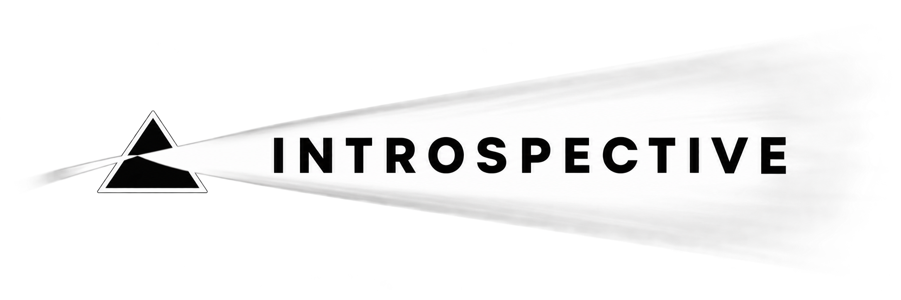

<p align="center">
  
</p>

<p align="center">
  <strong>The Local-First AI Pre-Production & Cinematic Visualization Suite</strong>
</p>

<p align="center">
  
  
  
  
  
</p>

---

## 🌟 Overview

**INTROSPECTIVE** (formerly *Script2Vision*) is a comprehensive, local-first pre-production intelligence platform that transforms raw screenplays into structured, actionable cinematic planning assets. 

Designed for directors, cinematographers, screenwriters, and creative producers, Introspective bridges the gap between text and visual execution. It analyzes dramatic tension, emotional pacing, scene lighting, lenses, camera movement, character relationship dynamics, and generates complete storyboards, mood boards, pitch decks, animatics, and production-ready exports.

---

## ✨ Key Features

### 🎬 Screenplay Parsing & Breakdown
- **Deterministic & Offline**: Parses Fountain and industry-standard script formats instantly without cloud latency.
- **Granular Scene Splitting**: Automatically extracts sluglines, scene headers, action blocks, character dialogue, parentheticals, and transitions.

### 🧠 Cinematic & Dramatic Intelligence
- **Scene-by-Scene Analysis**: Calculates emotional tone, tension gradients, pacing scores, and visual motifs.
- **Camera & Lighting Metadata**: Generates suggested camera shots, lenses, lighting styles, color palettes, and director notes.
- **Deterministic Caching**: Content-hashed scene caching guarantees you never re-analyze or incur API charges for unchanged scenes.

### 👥 Character Intelligence & Relationship Graphs
- **Entity Extraction**: Auto-identifies characters, aliases, and speaking frequencies.
- **Interactive Co-occurrence Graph**: Visualizes dynamic character relationships and scene-by-scene interactions without external dependencies.

### 🎥 Shot List & Director Journal
- **Automated Shot Lists**: Generates shot plans with estimated screen time, lens choices, and scene composition based on dialogue/action length.
- **Director Notes & Themes**: Tracks subtext, character intentions, and pacing cues across drafts.

### 🖼️ Visual Studio: Storyboards, Mood Boards & Animatics
- **Image Generation Integrations**: Compatible with local and networked image generators including **Flux Klein 4B**, **ComfyUI**, **Automatic1111**, and local SDXL backends.
- **Storyboard Sequencer**: Organize visual beats into sequential shot boards.
- **Animatic Player**: Real-time playback preview with pan/zoom timing and transitions.
- **Pitch Deck Builder**: Generate executive pitch decks with cinematic decks, character bios, and key art.

### 🔐 Privacy-First AI & Local Keystore
- **Triple Inference Modes**:
  - **Local Only**: Powered by [Ollama](https://ollama.com) (e.g. `llama3.2`, `mistral`, `qwen2.5`) with zero data leaving your machine.
  - **Cloud Only**: Connect OpenAI (`gpt-4o`, `gpt-4o-mini`) or Google Gemini (`gemini-2.5-flash`, `gemini-2.0-pro`).
  - **Hybrid (Recommended)**: Runs local models first, seamlessly falling back to cloud for complex queries with strict character caps.
- **Encrypted Storage**: API keys are encrypted at rest using PBKDF2 + Fernet (`keystore.enc`).

### 📦 Multi-Format Production Exports
- Export complete production packages in **PDF**, **Markdown**, **JSON**, or as a unified **ZIP Package** containing scripts, shot lists, character sheets, and generated artwork.

---

## 🏗️ Architecture

```
introspective/
├── backend/
│   ├── app/
│   │   ├── main.py                  # FastAPI application entry & router registration
│   │   ├── config.py                # Global configuration & environment paths
│   │   ├── db.py                    # SQLite database models (Project, Script, Scene, etc.)
│   │   ├── models/schemas.py        # Pydantic validation schemas
│   │   ├── api/                     # REST API endpoints (projects, scripts, settings, etc.)
│   │   ├── services/
│   │   │   ├── parser.py            # Screenplay parsing engine
│   │   │   ├── character_extraction.py # Character entity & alias consolidation
│   │   │   ├── cinematic_analysis.py# AI prompt builder & output normalizer
│   │   │   ├── cache.py             # SQLite deterministic AI cache
│   │   │   ├── export.py            # PDF, Markdown, JSON & ZIP export generators
│   │   │   ├── animatic.py          # Animatic timeline & preview compilation
│   │   │   ├── ai/                  # AI orchestrator & backend clients (Ollama, OpenAI, Gemini)
│   │   │   └── image/               # Image generation hooks (ComfyUI, Flux, A1111)
│   │   └── storage/keystore.py      # Encrypted local keystore
│   └── requirements.txt
│
├── frontend/
│   ├── public/
│   │   └── introspective-logo.png   # Introspective branding asset
│   ├── src/
│   │   ├── App.jsx                  # Main application router & core layout
│   │   ├── api/client.js            # API client wrapper
│   │   ├── components/              # Collapsible Sidebar, PitchDeck, AnimaticPlayer, UI kit
│   │   └── pages/                   # Dashboard, ScriptViewer, SceneExplorer, CharacterExplorer,
│   │                                # RelationshipGraph, ShotList, DirectorNotes, Settings, Exports
│   └── package.json
```

---

## 🚀 Getting Started

### Prerequisites
- **Python 3.10+**
- **Node.js 18+ & npm**
- *(Optional)* **[Ollama](https://ollama.com)** for local LLM inference
- *(Optional)* **[ComfyUI](https://github.com/comfyanonymous/ComfyUI)** or **Automatic1111** for image generation

---

### 1. Backend Setup

```bash
# Navigate to the backend directory
cd backend

# Create and activate a virtual environment
python3 -m venv .venv
source .venv/bin/activate  # On Windows: .venv\Scripts\activate

# Install dependencies
pip install -r requirements.txt

# Start the FastAPI server
python3 -m uvicorn app.main:app --reload --port 8420
```

The backend server will start at `http://127.0.0.1:8420`.

---

### 2. Frontend Setup

```bash
# In a new terminal, navigate to the frontend directory
cd frontend

# Install dependencies
npm install

# Start the Vite development server
npm run dev
```

Open `http://localhost:5173` in your browser.

---

## ⚙️ Configuration & AI Modes

Navigate to **Settings** in the application interface to configure your environment:

| AI Mode | Description | Requirements |
| :--- | :--- | :--- |
| **Local Only** | 100% private, runs entirely on your local hardware. | Ollama running at `http://localhost:11434` with any model (e.g. `ollama pull llama3.2`). |
| **Hybrid** *(Default)* | Attempts local Ollama inference first; falls back to cloud if unavailable or on high-complexity tasks. | Ollama and/or an OpenAI / Gemini API key. |
| **Cloud Only** | Directly calls OpenAI or Google Gemini. | Valid OpenAI or Gemini API Key entered in Settings. |

### Environment Variables (Optional)
You can customize backend defaults by setting environment variables or creating a `.env` file in `backend/`:

```env
S2V_AI_MODE=hybrid
S2V_OLLAMA_URL=http://localhost:11434
S2V_LOCAL_MODEL=llama3.2
S2V_OPENAI_MODEL=gpt-4o-mini
S2V_GEMINI_MODEL=gemini-2.5-flash
S2V_IMAGE_BACKEND=flux_klein_4b
S2V_COMFYUI_URL=http://127.0.0.1:8188
```

---

## 🛡️ Privacy & Security

- **No Unsolicited Telemetry**: Introspective does not log or transmit your screenplays to external telemetry endpoints.
- **Local SQLite & Files**: Projects, parsed scenes, and AI cache entries reside strictly on your local disk (`backend/data/`).
- **Encrypted Secrets**: Cloud provider API keys are encrypted using symmetric Fernet keys derived with PBKDF2 and saved in `backend/data/keystore.enc`.

---

## 📄 License

This project is licensed under the [MIT License](LICENSE).
